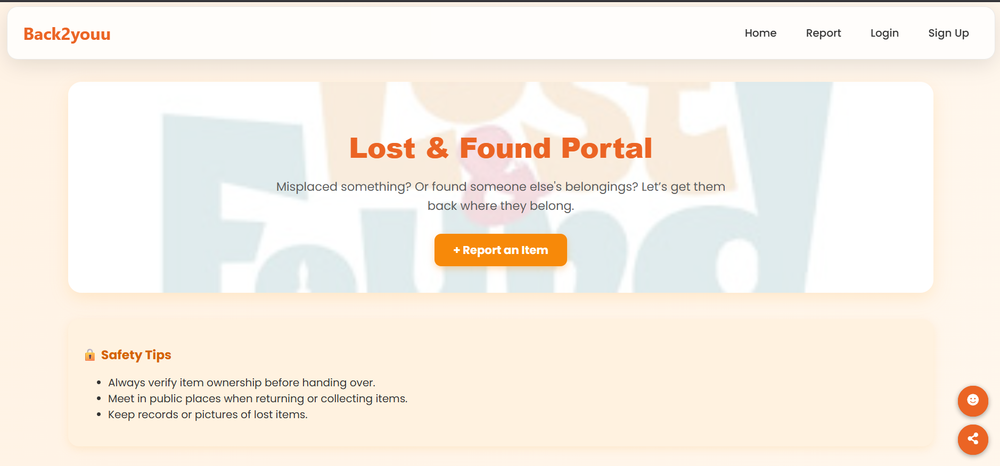
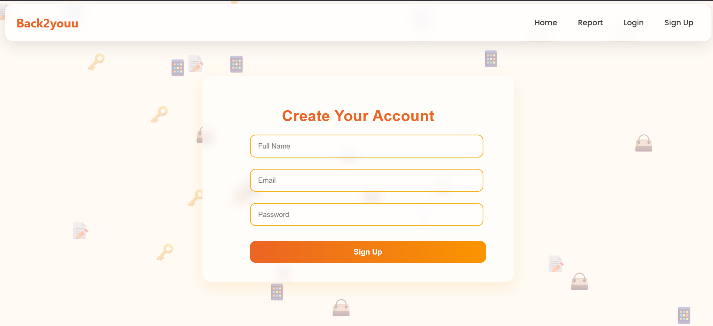
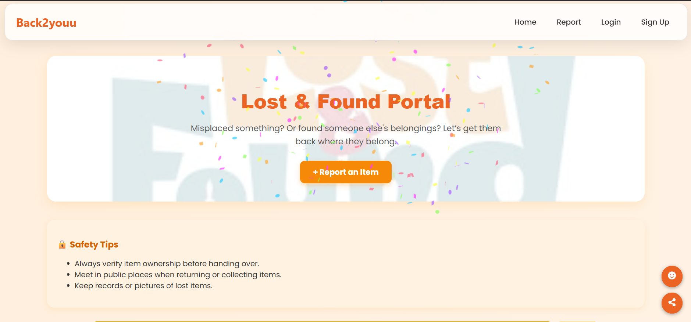
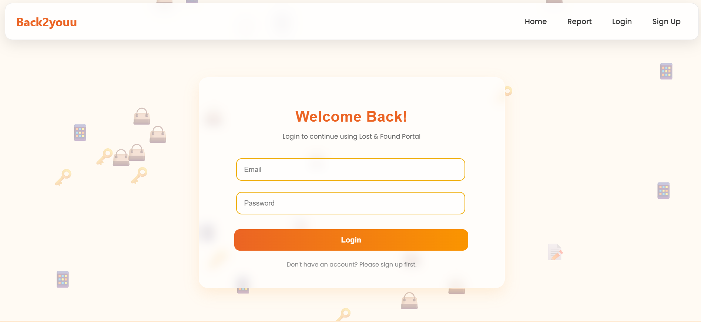

# 🕵️‍♂️ Back2youu

A responsive web app to report, find, and manage lost and found items within a community.

[](https://app.netlify.com/sites/back2youu/deploys)

---

## 🚀 Features
- 🔍 **Browse Items** — View reported lost and found items in a neat card layout
- 📝 **Add Report** — Users can report lost or found items with details
- 👤 **Authentication** — Secure Login and Signup functionality
- 🌙 **Theme Toggle** — Light/Dark mode support
- 📑 **My Reports** — View and manage your submitted reports
- 📱 **Responsive Design** — Mobile-friendly and fully responsive UI
- ☁️ **Deployed on Netlify**

---

## 🛠️ Tech Stack
- **Frontend** — React.js, React Router, Context API
- **Styling** — Custom CSS with Responsive Design
- **Auth & Context** — React Context + LocalStorage
- **Toast Notifications** — `react-toastify`
- **Deployment** — Netlify

---

## 🖥️ Live Demo  
[🔗 Open Live Site](https://back2youu.netlify.app/)

---

## 📸 Screenshots  

### 🏠 Home Page  


### ✨ Signup Page  


### 🎉 Success Celebration  


### 🔐 Login Page  


---


## 📂 Folder Structure
```
/src
 ├── components   # Navbar, Footer, ThemeToggle, ItemCard
 ├── pages        # Home, AddItems, Login, Signup, MyReports
 ├── context      # AuthContext
 ├── assets       # Images, Icons (if any)
 ├── App.js
 └── index.js
```

---

## 📝 How to Run Locally
```bash
# Clone the repository
git clone https://github.com/aarohidixit31/Lost-and-Found.git

# Navigate into project folder
cd Lost-and-Found

# Install dependencies
npm install

# Start development server
npm start
```

---

## 🤝 Contributing
Contributions, suggestions, and feedback are welcome!  
Feel free to open issues or pull requests.

---

## 📜 License
This project is licensed under the [MIT License](LICENSE).

---

## ✨ Author
**Aarohi Dixit**  
[GitHub](https://github.com/aarohidixit31) | [LinkedIn](https://linkedin.com/in/aarohidixit)

